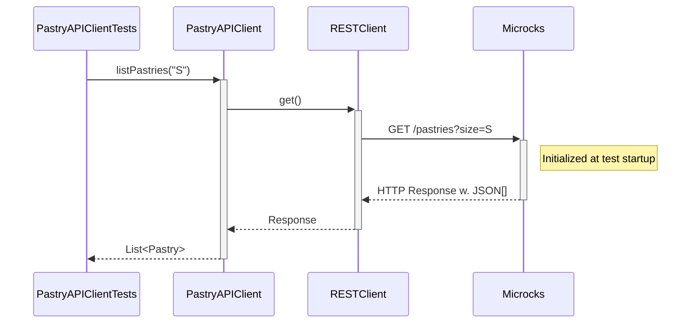
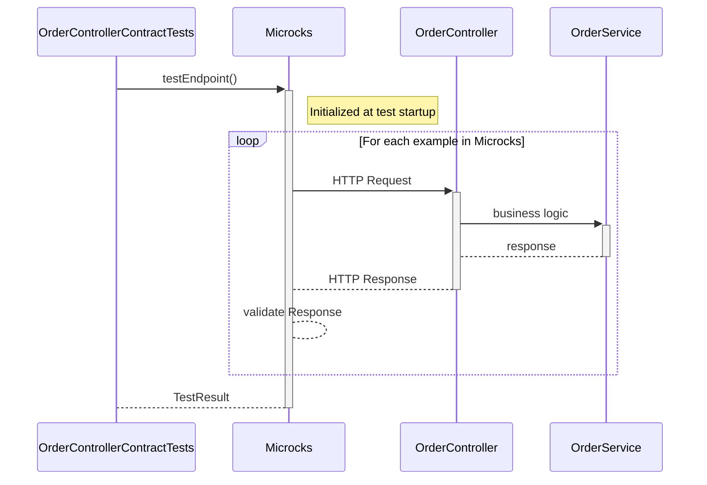

# Step 4: Let's write tests for the REST APIs

So far, we focused on being able to run the application locally without having to install or run any dependent services manually.
But there is nothing more painful than working on a codebase without a comprehensive test suite.

Let's fix that!!

## First Test - Verify our RESTClient

In this section, we'll focus on testing the `Pastry API Client` component of our application:

The sequence diagram below details the test sequence. Microcks is used as a third-party backend to allow going through all the layers:

## Second Test - Verify the technical conformance of Order Service API

The 2nd thing we want to validate is the conformance of the `Order API` we'll expose to consumers. In this section and the next one,
we'll focus on testing the `OrderController` component of our application:

Here, we're using a Microcks-provided `TestRequest` object that allows us to specify to Microcks the scope of the conformance
test we want to run:
* We ask for testing our endpoint against the service interface of `Order Service API` in version `0.1.0`.
  These are the identifiers found in the `order-service-openapi.yml` file.
* We ask Microcks to validate the `OpenAPI Schema` conformance by specifying a `runnerType`.
* We ask Microcks to validate the localhost endpoint on the dynamic port provided by the Spring Test (we use the `host.testcontainers.internal` alias for that).

Finally, we're retrieving a `TestResult` from Microcks containers, and we can assert stuffs on this result, checking it's a success.

The sequence diagram below details the test sequence. Microcks is used as a middleman that actually invokes your API with the example from its dataset: 

Our `OrderController` development is technically correct: all the JSON and HTTP serialization layers have been tested!

### 
[Next](step-5-write-async-tests.md)