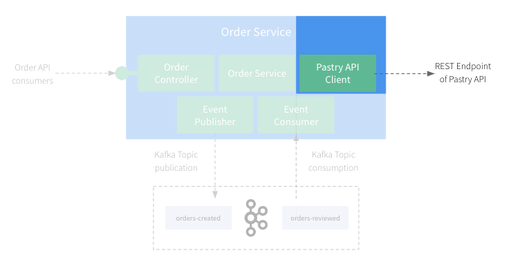
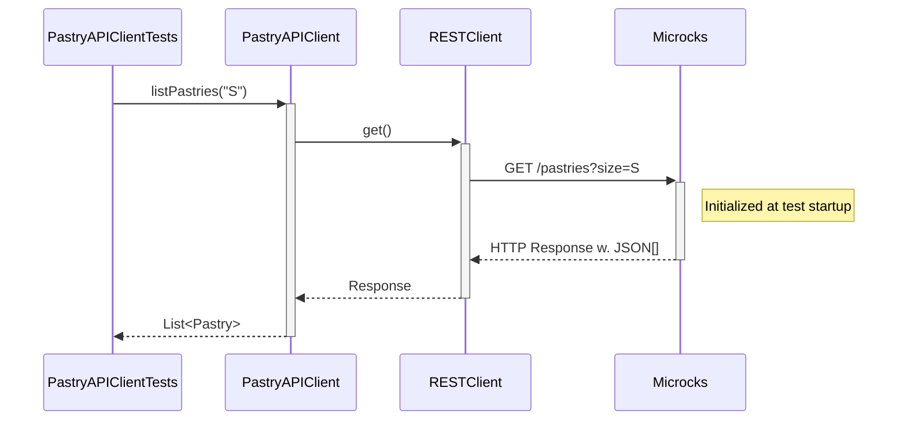
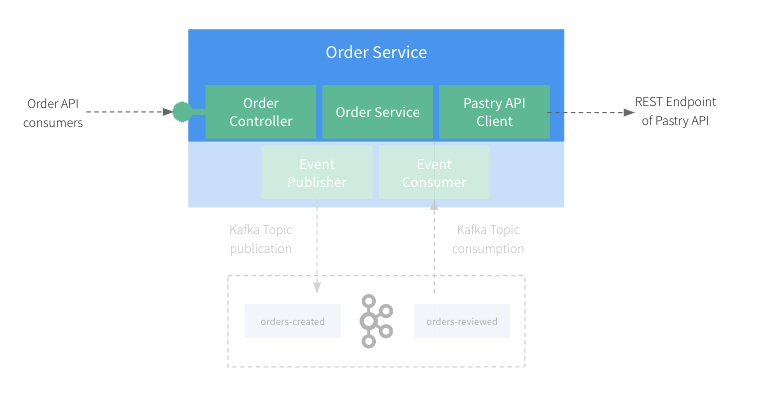
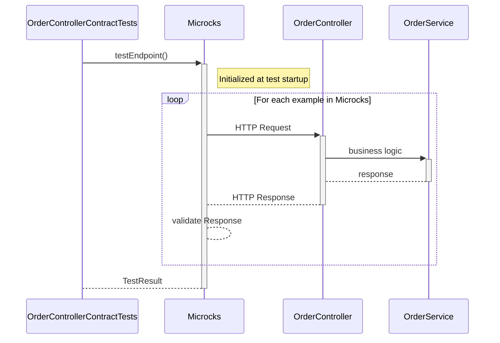

# Step 4: Let's write tests for the REST APIs

So far, we focused on being able to run the application locally without having to install or run any dependent services manually.
But there is nothing more painful than working on a codebase without a comprehensive test suite.

Let's fix that!!


## First Test - Verify our RESTClient

In this section, we'll focus on testing the `Pastry API Client` component of our application:



Let's review the test spec `pastry.service.spec.ts` under `src/pastry`.

The first important thing to notice is the setup phase of the test that happens in the `beforeAll()` function:

```ts
  beforeAll(async () => {
    // Start container and load artifacts.
    container = await new MicrocksContainer('quay.io/microcks/microcks-uber:1.10.0-native')
      .withMainArtifacts([path.resolve(resourcesDir, 'apipastries-openapi.yml')])
      .withSecondaryArtifacts([path.resolve(resourcesDir, 'apipastries-postman-collection.json')])
      .start();

    const module: TestingModule = await Test.createTestingModule({
      imports: [ConfigModule.forRoot({
        load: [() => ({
          'pastries.baseurl': container.getRestMockEndpoint('API Pastries', '0.0.1')
        })],
      })],
      providers: [PastryService],
    }).compile();

    service = module.get<PastryService>(PastryService);
  });
```

This is where we're launching the Microcks Testcontainers module and configure it with the resources we need. Here we're loading 
the Pastry API [`apipastries-openapi.yml`](test/resources/apipastries-openapi.yml) OpenAPI specification as well as a complementary
[`apipastries-postman-collection.json`](test/resourcesapipastries-postman-collection.json) Postman Collection that contains additional 
examples.

We're also configuring the application to use a REST mock endpoint provided by the Microcks container for this API.

Then, we can simply proceed and execute some tests:

```ts
  it('should retrieve pastry by name', async () => {
    let pastry: Pastry = await service.getPastry('Millefeuille');
    expect(pastry.name).toBe("Millefeuille");
    expect(pastry.status).toBe("available");

    pastry = await service.getPastry('Eclair Cafe');
    expect(pastry.name).toBe("Eclair Cafe");
    expect(pastry.status).toBe("available");

    pastry = await service.getPastry('Eclair Chocolat');
    expect(pastry.name).toBe("Eclair Chocolat");
    expect(pastry.status).toBe("unknown");
  });

  it('should retrieve pastries by size', async () => {
    let pastries: Pastry[] = await service.getPastries('S');
    expect(pastries.length).toBe(1);

    pastries = await service.getPastries('M');
    expect(pastries.length).toBe(2);

    pastries = await service.getPastries('L');
    expect(pastries.length).toBe(2);
  });
```

> You can execute this test from your IDE or from the terminal using the `npm run test --runTestsByPath src/pastry/pastry.service.spec.ts` command.

If you run this test, it should pass and that means we have successfully configured the application to start with all the required containers
and that they're correctly wired to the application. Within this test:
* We're reusing the data that comes from the examples in the `Pastry API` OpenAPI specification and Postman collection.
* The `PastryService` has been configured with a `pastries.baseurl` that is wired to the Microcks mock endpoints.
* We're validating the configuration of this client as well as all the JSON and network serialization details of our configuration!  

The sequence diagram below details the test sequence. Microcks is used as a third-party backend to allow going through all the layers:



### 🎁 Bonus step - Check the mock endpoints are actually used

While the above test is a good start, it doesn't actually check that the mock endpoints are being used. In a more complex application, it's 
possible that the client is not correctly configured or use some cache or other mechanism that would bypass the mock endpoints. 
In order to check that you can actually use the `verify()` method available on the Microcks container:

```ts
it('should retrieve pastry by name', async () => {
  let pastry: Pastry = await service.getPastry('Millefeuille');
  expect(pastry.name).toBe("Millefeuille");
  expect(pastry.status).toBe("available");

  pastry = await service.getPastry('Eclair Cafe');
  expect(pastry.name).toBe("Eclair Cafe");
  expect(pastry.status).toBe("available");

  pastry = await service.getPastry('Eclair Chocolat');
  expect(pastry.name).toBe("Eclair Chocolat");
  expect(pastry.status).toBe("unknown");

  // Check that the mock API has really been invoked.
  let mockInvoked: boolean = await container.verify("API Pastries", "0.0.1");
  expect(mockInvoked).toBe(true);
});
```

`verify()` takes the target API name and version as arguments and returns a boolean indicating if the mock has been invoked. 
This is a good way to ensure that the mock endpoints are actually being used in your test.

If you need finer-grained control, you can also check the number of invocations with `getServiceInvocationsCount()`. This way you can check 
that the mock has been invoked the correct number of times:

```ts
it('should retrieve pastries by size', async () => {
  // Get the number of invocations before our test.
  let beforeMockInvocations: number = await container.getServiceInvocationsCount("API Pastries", "0.0.1");

  let pastries: Pastry[] = await service.getPastries('S');
  expect(pastries.length).toBe(1);

  pastries = await service.getPastries('M');
  expect(pastries.length).toBe(2);

  pastries = await service.getPastries('L');
  expect(pastries.length).toBe(2);

  // Check our mock API has been invoked the correct number of times.
  let afterMockInvocations: number = await container.getServiceInvocationsCount("API Pastries", "0.0.1");
  expect(afterMockInvocations - beforeMockInvocations).toBe(3);
});
```

This is a super powerful way to ensure that your application logic (caching, no caching, etc.) is correctly implemented and 
use the mock endpoints when required 🎉

## Second Test - Verify the technical conformance of Order Service API

The 2nd thing we want to validate is the conformance of the `Order API` we'll expose to consumers. In this section and the next one,
we'll focus on testing the `OrderController` component of our application:



Microcks Testcontainer integration provides another approach by letting you reuse the OpenAPI specification directly in your test suite,
without having to write assertions and validation of messages for API interaction.

Let's review the test class `orders.api.e2e-spec.ts` under `test`:

```ts
  it('should conform to OpenAPI spec', async () => {
    var testRequest: TestRequest = {
      serviceId: "Order Service API:0.1.0",
      runnerType: TestRunnerType.OPEN_API_SCHEMA,
      testEndpoint: "http://host.testcontainers.internal:" + appPort,
      timeout: 3000
    };

    var testResult = await container.testEndpoint(testRequest);

    console.log(JSON.stringify(testResult, null, 2));

    expect(testResult.success).toBe(true);
    expect(testResult.testCaseResults.length).toBe(1);
    expect(testResult.testCaseResults[0].testStepResults.length).toBe(2);
  });
```

> You can execute this test from the terminal using the `npm run test:e2e --runTestsByPath test/orders.api.e2e-spec.ts` command.

Here, we're using a Microcks-provided `TestRequest` object that allows us to specify to Microcks the scope of the conformance
test we want to run:
* We ask for testing our endpoint against the service interface of `Order Service API` in version `0.1.0`.
  These are the identifiers found in the `order-service-openapi.yml` file.
* We ask Microcks to validate the `OpenAPI Schema` conformance by specifying a `runnerType`.
* We ask Microcks to validate the localhost endpoint on the dynamic port provided by the `beforeAll()` function (we use the `host.testcontainers.internal` alias for that).

Finally, we're retrieving a `TestResult` from Microcks containers, and we can assert stuffs on this result, checking it's a success.

The sequence diagram below details the test sequence. Microcks is used as a middleman that actually invokes your API with the example from its dataset: 



Our `OrderController` development is technically correct: all the JSON and HTTP serialization layers have been tested!


## Third Test - Verify the business conformance of Order Service API

The above section allows us to validate the technical conformance but not the business one! Imagine we forgot to record all the
requested products in the order or change the total price in resulting order. This could raise some issues!

Microcks allows to execute business conformance test by leveraging Postman Collection. If you're familiar with Postman Collection
scripts, you'll open the `order-service-postman-collection.json` file and find some snippets like:

```jshelllanguage
pm.test("Correct products and quantities in order", function () {
    var order = pm.response.json();
    var productQuantities = order.productQuantities;
    pm.expect(productQuantities).to.be.an("array");
    pm.expect(productQuantities.length).to.eql(requestProductQuantities.length);
    for (let i=0; i<requestProductQuantities.length; i++) {
        var productQuantity = productQuantities[i];
        var requestProductQuantity = requestProductQuantities[i];
        pm.expect(productQuantity.productName).to.eql(requestProductQuantity.productName);
    }
});
```

You can now validate this from your Javascript Unit Test as well! Let's review the test class `orders.api.postman.e2e-spec.ts` 
under `test`:

```ts
  it ('should conform to Postman rules', async () => {
    var testRequest: TestRequest = {
      serviceId: "Order Service API:0.1.0",
      runnerType: TestRunnerType.POSTMAN,
      testEndpoint: "http://host.testcontainers.internal:" + appPort,
      timeout: 3000
    };

    var testResult = await ensemble.getMicrocksContainer().testEndpoint(testRequest);

    console.log(JSON.stringify(testResult, null, 2));

    expect(testResult.success).toBe(true);
    expect(testResult.testCaseResults.length).toBe(1);
    expect(testResult.testCaseResults[0].testStepResults.length).toBe(2);
  });
```

> You can execute this test from the terminal using the `npm run test:e2e --runTestsByPath test/orders.api.postman.e2e-spec.ts` command.

This snippet typically describes business constraints telling that a valid order response should have unchanged product and quantities. 

Comparing to the code in previous section, the only change here is that we asked Microcks to use a `Postman` runner
for executing our conformance test. What happens under the hood is now that Microcks is re-using the collection snippets
to put some constraints on API response and check their conformance.

The test sequence is exactly the same as in the previous section. The difference here lies in the type of response validation: Microcks
reuses Postman collection constraints.

You're now sure that beyond the technical conformance, the `Order Service` also behaves as expected regarding business 
constraints. 

### 🎁 Bonus step - Verify the business conformance of Order Service API in pure JS/TS

Even if the Postman Collection runner is a great way to validate business conformance, you may want to do it in pure JavaScript. 
This is possible by retrieving the messages exchanged during the test and checking their content. Let's review the 
`should conform to OpenAPI spec and Business rules` test under `test/orders.api.e2e-spec.ts`:

```ts
it('should conform to OpenAPI spec and Business rules', async () => {
  var testRequest: TestRequest = {
    serviceId: "Order Service API:0.1.0",
    runnerType: TestRunnerType.OPEN_API_SCHEMA,
    testEndpoint: "http://host.testcontainers.internal:" + appPort,
    timeout: 3000
  };

  var testResult = await container.testEndpoint(testRequest);

  console.log(JSON.stringify(testResult, null, 2));

  expect(testResult.success).toBe(true);
  expect(testResult.testCaseResults.length).toBe(1);
  expect(testResult.testCaseResults[0].testStepResults.length).toBe(2);

  // You may also check business conformance.
  let pairs: RequestResponsePair[] = await container.getMessagesForTestCase(testResult, "POST /orders");

  for (let i=0; i<pairs.length; i++) {
    const pair = pairs[i];
    if (pair.response.status === "201") {
      const requestPQS = JSON.parse(pair.request.content).productQuantities;
      const responsePQS = JSON.parse(pair.response.content).productQuantities;
      
      expect(responsePQS).toBeDefined();
      expect(responsePQS.length).toBe(requestPQS.length);
      for (let j=0; j<requestPQS.length; j++) {
        const requestPQ = requestPQS[j];
        const responsePQ = responsePQS[j];
        expect(responsePQ.productName).toBe(requestPQ.productName);
      }
    }
  }
});
```

This test is a bit more complex than the previous ones. It first asks for an OpenAPI conformance test to be launched and then retrieves 
the messages to check business conformance, following the same logic that was implemented into the Postman Collection snippet.

It uses the `getMessagesForTestCase()` method to retrieve the messages exchanged during the test and then checks the content. While this 
is done in pure JavaScript here, you may use the tool or library of your choice like [Cucumber](https://cucumber.io/docs/installation/javascript/) 
or others.

### 
[Next](step-5-write-async-tests.md)